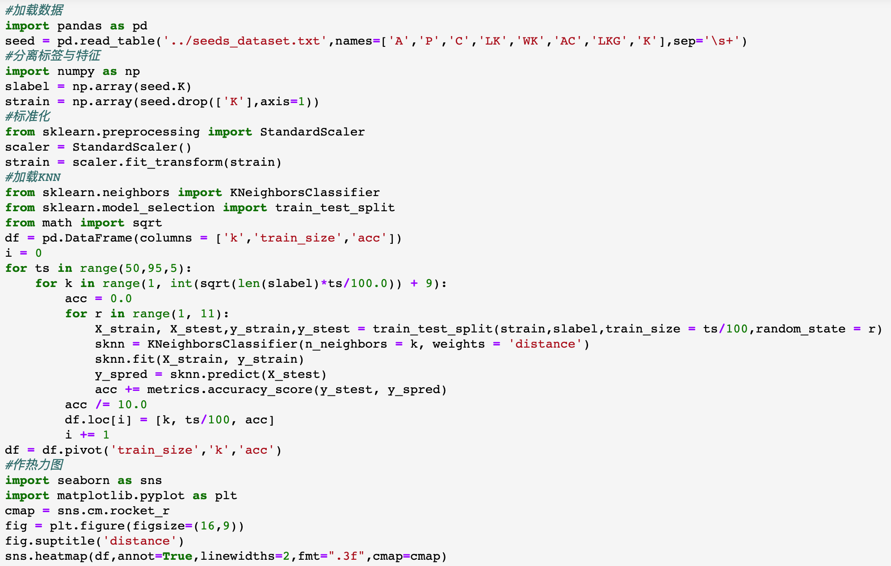
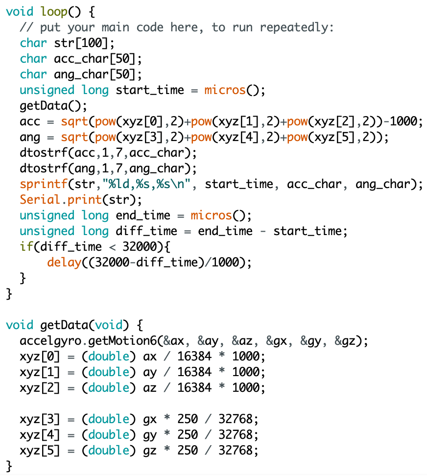

# 科研报告

#### <center>学校：南京大学</center>

#### <center>报告人：陈诚</center>

#### <center>实习单位：中科院计算技术研究所</center>

#### <center>实习起止时间：2019年9月14日至2019年10月7日</center>

## 研究背景

物联网作为互联网的下半场，是目前人工智能最有潜力的研究方向之一。无线环境感知作为物联网最有挑战的领域成为新的创新趋势。

## 理论知识点回顾

### 掌握python高效的数据可视化库的使用

#### seaborn/matplotlib

seaborn 是一个基于 matplotlib 且与 numpy 和 pandas 数据结构紧密集成的 python 数据可视化库。matplotlib 功能强大而代码复杂，seaborn 在 matplotlib 的基础上进行了更高级的API封装

1. 热力图(**heatmap**): 用于调参即寻找最佳参数
   - 划分训练集测试集```train_size```

   - 决定决策树最大深度```max_depth```

   - $knn​$算法中的参数```k```

   <div align="middle">
     <table style="width=100%">
       	  
       		<figcaption align="middle">k & train_size</figcaption>
     </table>
   </div>

2. kde 图、小提琴图、箱线图：数据分布特征

   <div align="middle">
     <table style="width=100%">
       	  
       		<figcaption align="middle">小麦籽粒宽度的分布</figcaption>
     </table>
   </div>

3. 散点图、多变量分布图、回归图：数据间关系

### 机器学习

#### KNN

KNN-KNearestNeighbor 分类算法，是一个理论上比较成熟的算法，是数据挖掘分类技术中最简单的方法之一

1. 核心思想: (多数表决)如果一个样本在特征空间中的$k​$个最相邻的样本中的大多数属于某一个类别，则该样本也属于这个类别，并且具有这个类别上样本的特性。

   - $k$值为经验值，一般取奇数，一般情况下取$k\in(1,\sqrt{n})​$

   - 对噪声(异常值)不敏感

2. **Kd-KDimention** 树: 对数据点在$k$维空间中划分的一种数据结构(二叉树)

   - 核心思想: 把整个空间划分为特定的几个部分，然后在特定空间的部分内进行相关搜索操作

   - 在样本方差 $S^2$  最大的维度进行划分，在划分出的子空间不断重复

3. 权重 (distance/uniform)

   - **uniform**: $k$个样本权值相同

   - **distance**: 样本的权值为距离的倒数(解决样本不平衡的分类问题)

4. 代码实例

   <div align="middle">
     <table style="width=100%">
       	  
       		<figcaption align="middle">knn</figcaption>
     </table>
   </div>

#### 朴素贝叶斯

1. 源于古典数学理论，有坚实的数学基础

   $$P(C_K|A)=\frac{P(C_K)\times \prod_{i=0}^n P(A_i|C_K)}{\prod_{i=0}^n P(A_i)}$$

   - $C_K=C_1,C_2,C_3,\cdots,C_n$为样本类别

   - $A=A_1,A_2,A_3,\cdots,A_n​$为为样本特征

2. 要求特征独立，导致实际应用有限

3. 适合增量学习，指一个学习系统能不断地从新样本中学习新的知识，并能保存大部分以前已经学习到的知识无需保存历史数据，从而减少存储空间的占用

#### 决策树

1. 信息熵(**ID3决策树**)

   - 假设有$K$个类，第$k$类样本在数据集$D$中占的比例为$p_k$，则数据集$D$的基尼指数为

     $$Ent(D) = -\sum_{k=1}^K p_k\log_2 p_k$$

   - 信息熵越小，数据集纯度越高

   - 离散属性$a​$的信息增益

     - 假设$a$有$V$个可能取值$\{a^1,a^2,\cdots,a^V\}$，对样本集进行划分会产生$V$个分支节点，第$v$个节点包含$D$中所有在属性$a$上取值为$a_v$的样本，记为$D_v$

       $$Gain(D,a)=Ent(D)-\sum_{v=1}^V\frac{|D^v|}{|D|}Ent(D_v)$$

     - 信息增益**越高**的属性分裂出的子节点**纯度越高**，优先划分信息增益高的属性

2. 基尼指数(**CART决策树**)

   - 假设有$K$个类，第$k$类样本在数据集$D$中占的比例为$p_k$，则数据集$D​$的基尼指数为

     $$Gini(D)=\sum_{k=1}^K p_k(1-p_k)=1-\sum_{k=1}^K p_k^2$$

   - 基尼指数反映了从数据集$D$中随机抽取两个样本，其类别标记不一致的概率
   - 基尼指数越小，数据集纯度越高

### 嵌入式编程与无线传感数据采集处理

#### Arduino

Arduino 是一款便捷灵活、方便上手的开源电子原型平台，包含硬件开发板和软件IDE。

**硬件设施**

- Arduino Mega 2560 & 扩展版 Base Shield

- Grove-IMU 10DOF v2.0 is base on **MPU-9250** and **BMP280**, the MPU-9250 is a 9-axis MotionTracking device that combines a 3-axis gyroscope, 3-axis accelerometer, 3-axis magnetometer and a Digital Motion Processor(DMP), and BMP280 is a high precision, ultra-low power digital pressure sensors for consumer applications. This module is very suitable for the application of smartphones, tablets and wearable devices.

**代码实例**

<div align="middle">
  <table style="width=100%">
    	  
    		<figcaption align="middle">IMU</figcaption>
  </table>
</div>


#### Segger Embedded Studio

Segger Embedded Studio 是一款功能强大的 C/C++ 针对于单片机开发的IDE，可跨平台使用。

**硬件设施**

- NRF52840-PDK 是一款使用 nRF52840 SoC 的多功能单板开发套件，专用于蓝牙5.0、蓝牙低功耗、ANT、802.15.4 和 2.4GHz 专有应用。此套件支持 nRF52840 SoC 的开发。该器件还在硬件上兼容 Arduino Uno R3 标准，因此可使用这种标准兼容的第三方扩展板。该套件可通过连接器访问所有的 I/O 和接口，以及四个 LED 和四个用户可编程的按钮。添加 NFC 天线能让套件支持 NFC 标签功能。

#### WIFI hub bluetooth 5.0 ble IOT gateway receiver

**硬件设施**

- G1 is a Bluetooth low energy (BLE) to Wi-Fi connectivity gateway without the uses of smartphones or apps. The G1 gateway collects the data from **iBeacon**, Eddystone, BLE sensor and other BLE devices, and then sends to the local server or remote cloud server by HTTP / MQTT protocol over Wi-Fi / Ethernet. The subsequent version G1 Gateway will also implement the connection with BLE devices.

## 项目收获

1. [完成一个机器学习案例分析](<https://www.bilibili.com/video/av70437074>)

2. [无线传感感知数据的获取、预处理、滤波、频谱分析、样本标记[采集复印机在不同工作状态下的震动细节，中间加入人为搬动复印机的扰动]](<https://www.bilibili.com/video/av71147855>)